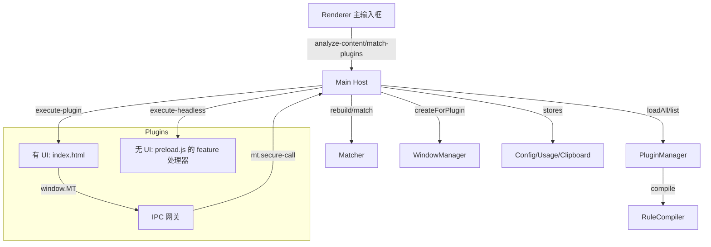
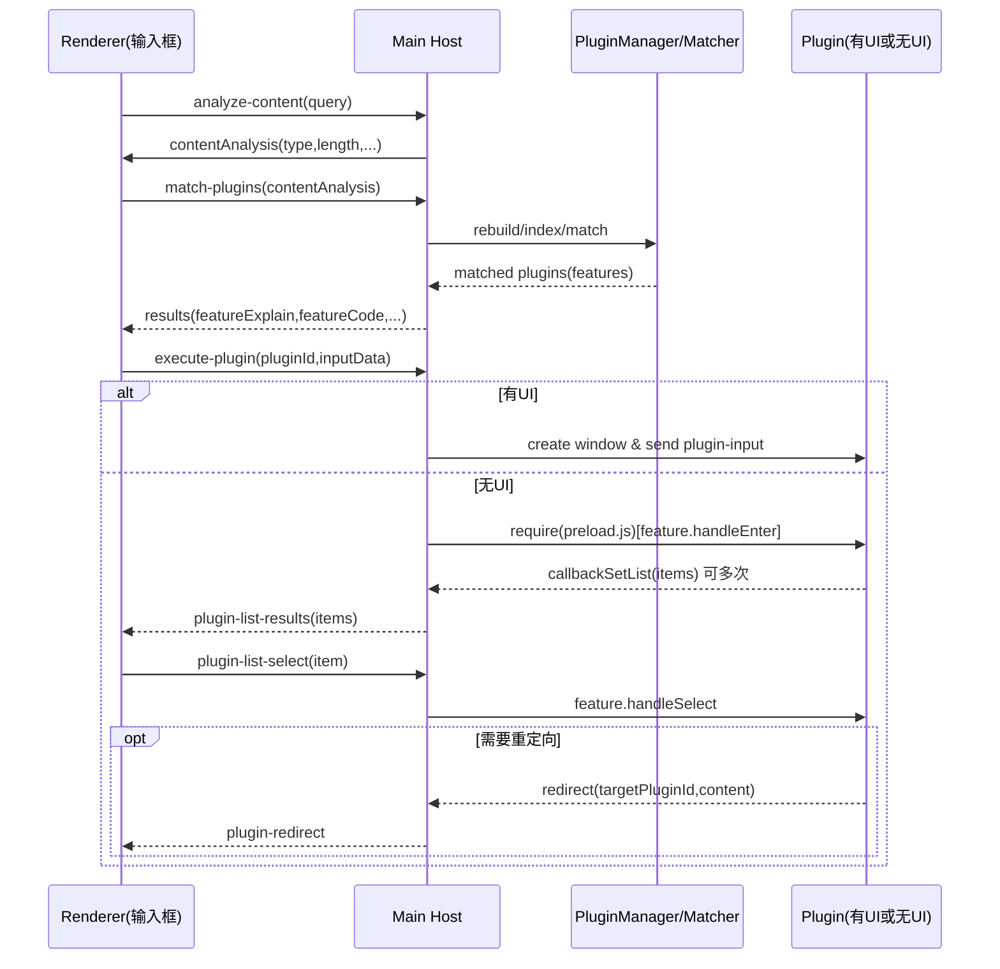
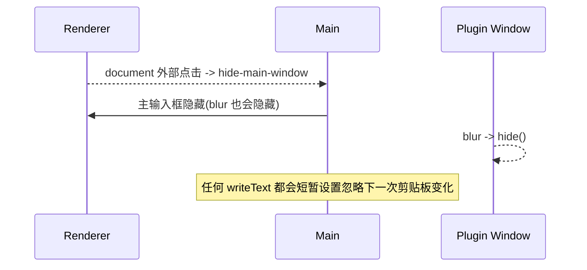
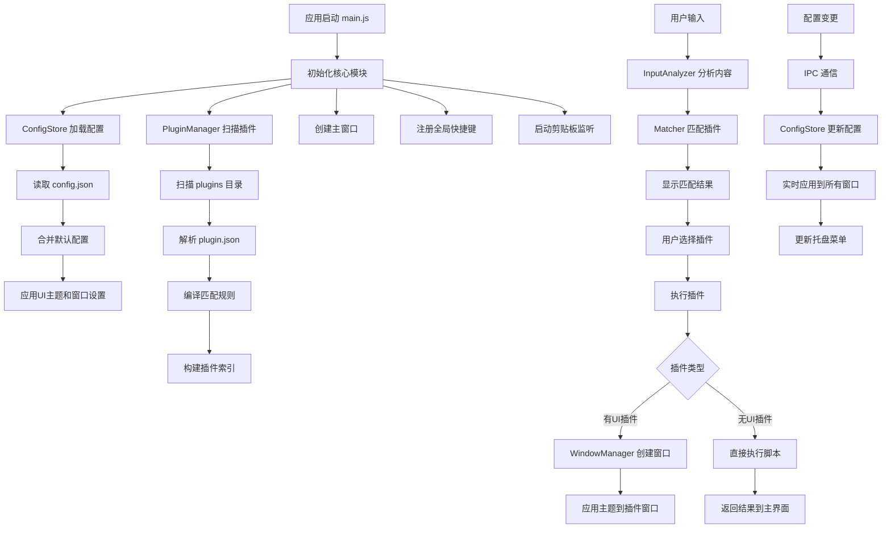
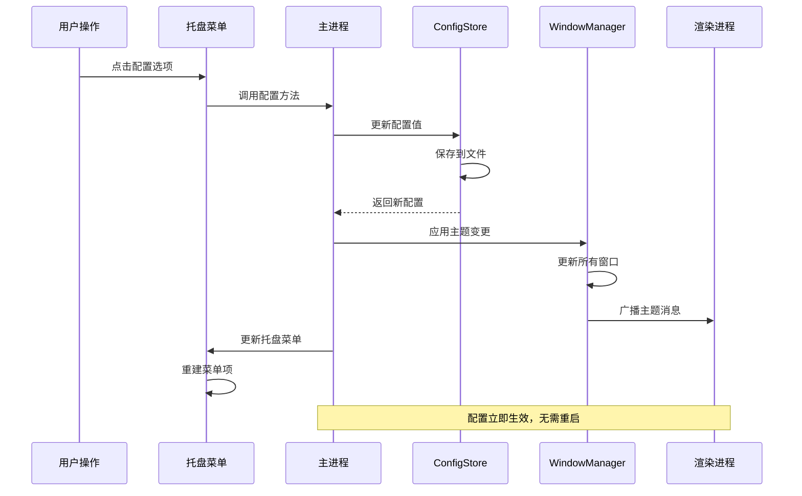
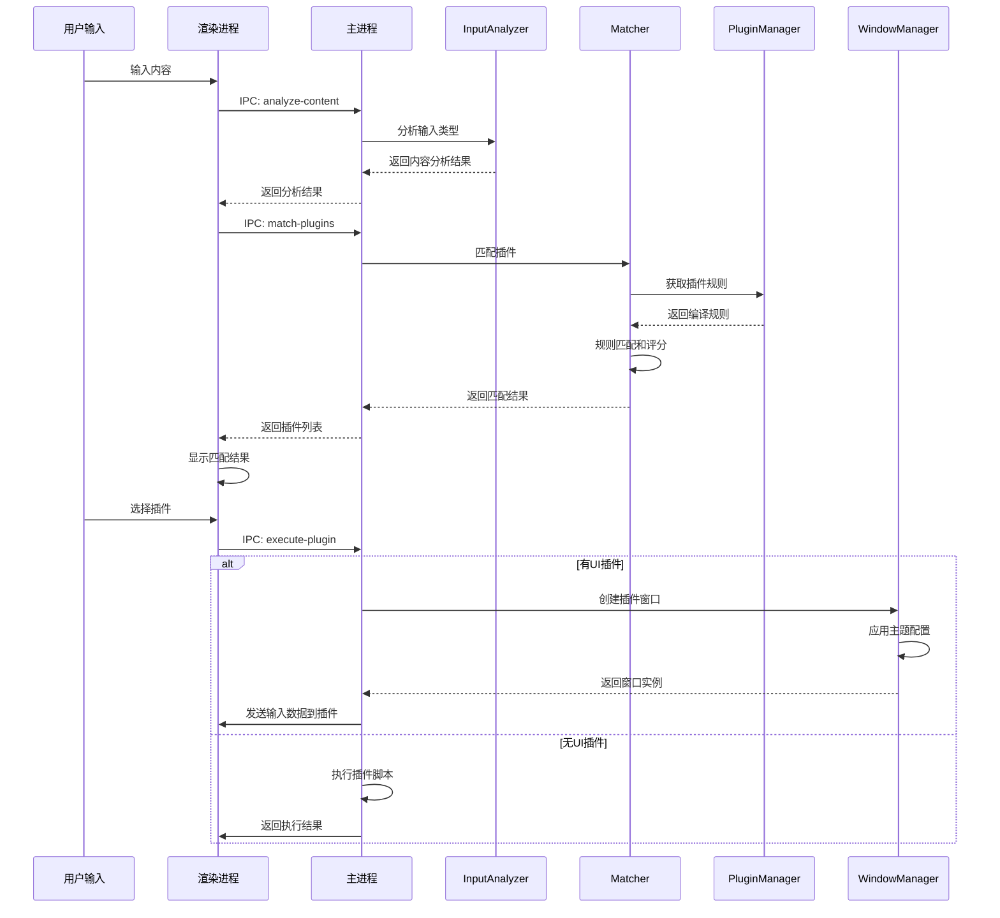

# MiniToolbox - 轻量化插件桌面工具箱

基于 Electron 的插件式工具箱，采用“注册-匹配-决策”核心架构，高效可扩展，遵循“一切皆插件”。

## 架构总览（Host ↔ Plugin）

- 核心层（Host 主程序）
  - 插件管理 PluginManager：扫描 `plugins/`，解析 `plugin.json`，编译匹配规则
  - 输入分析 InputAnalyzer：判断输入类型（text/url/file/image/json/email...）
  - 规则编译 RuleCompiler：将 `features[].cmds` 编译为可执行规则（regex/keyword/prefix/files）
  - 匹配器 Matcher：仅规则命中才进入候选（文本类）；结合使用偏好分排序
  - 窗口管理 WindowManager：按插件元信息创建/管理窗口（存在 `index.html` 即视为有 UI），失焦自动隐藏
  - 配置/偏好/历史：`ConfigStore`、`UsageStore`、`ClipboardStore`
  - IPC 网关：提供受限 API（如剪贴板、网络、外链打开、剪贴板历史）

- 插件生态（Plugin）
  - `plugin.json` 通过 `features` 声明能力；Host 将规则编译后统一匹配
  - 有 UI：`index.html`（可配 `window` 尺寸），通过 `window.MT` 调用受限 API
  - 无 UI（Headless）：在 `preload` 指定的 JS 中导出各 `feature.code` 对应的处理器对象：`{ handleEnter, handleSelect }`

### 系统架构图



## 流程图

### 输入到匹配到执行（主流程）



### 隐藏与剪贴板行为



### 详细代码流程图



### 配置刷新时序图




### 插件匹配和执行时序图




## 目录结构

```
src/
  core/
    inputAnalyzer.js    # 输入类型分析
    ruleCompiler.js     # 规则编译器（features → 可执行规则）
    pluginManager.js    # 插件清单加载与元信息构建
    matcher.js          # 索引构建、匹配、打分排序
    windowManager.js    # 插件窗口创建与管理
    usageStore.js       # 插件使用频次，偏好排序
    clipboardStore.js   # 剪贴板历史
  preload/
    plugin-preload.js   # 暴露安全 API（window.MT）
  renderer/
    index.html / renderer.js / style.css
plugins/
  <your-plugin>/plugin.json
  <your-plugin>/index.html|index.js|script.js
```

## 快速开始

1. `npm i`（或运行 `start.bat`）
2. 运行：`npm run dev` 或 `npm start`
3. `Ctrl+Space` 唤醒输入框，输入内容进行匹配

## 代码执行流程（要点）

- Renderer 仅做输入、显示结果、收发 IPC；输入时使用 `analyze-content` 与 `match-plugins`
- Main 将 `plugins/` 扫描为元信息，存在 `index.html` 判定 `ui=true`，`preload` 指向无 UI 处理模块
- 规则：`regex | keyword | prefix | files`，文本类只在规则命中时展示
- 无 UI 插件通过 `handleEnter(action, callbackSetList)` 产出列表，`handleSelect(action, itemData, callbackSetList)` 处理二级动作
- 剪贴板写入：主进程统一拦截一次，短时间忽略自动回填
- 隐藏规则：
  - 主输入框 blur 自动隐藏；点击输入框/结果之外区域隐藏
  - 插件窗口 blur 自动隐藏

## 插件开发

- 声明文件 `plugin.json`（核心字段）：
```json
{
  "id": "my-plugin",
  "name": "我的插件",
  "description": "说明",
  "logo": "🔧",
  "window": { "width": 720, "height": 560, "resizable": true },
  "preload": "preload.js",
  "permissions": ["net", "clipboard"],
  "features": [
    {
      "code": "demo.do",
      "explain": "示例动作",
      "cmds": [
        { "type": "keyword", "value": "demo" },
        { "type": "prefix", "value": "demo " },
        { "type": "regex", "match": "/^do:.+/i" }
      ]
    }
  ]
}
```

- 有 UI 插件：`index.html` + `script.js`，通过 `window.MT.invoke(channel, ...)` 与 Host 交互
- 无 UI 插件：在 `preload.js` 中按 feature 导出处理器对象：

```js
// preload.js（无 UI 插件的功能处理器）
module.exports['demo.do'] = {
  async handleEnter(action, callbackSetList) {
    const text = String(action.payload || '').trim();
    if (!text) {
      callbackSetList([{ title: '请输入内容', description: '', data: null }]);
      return;
    }
    // 产出列表项（可多次调用，以分步加载）
    callbackSetList([{ title: '处理结果', description: text.toUpperCase(), data: { value: text } }]);
  },
  async handleSelect(action, item, callbackSetList) {
    // 处理列表点击，如复制/跳转/二级列表
    const { redirect } = action;
    if (redirect) redirect('json-formatter', JSON.stringify({ picked: item }, null, 2));
  }
};
```

### 图标与 Logo 配置指南

通过 `plugin.json` 的 `logo` 字段为插件设置图标。系统在不同位置的显示规则如下：

- 列表（主输入框下的插件结果列表）
  - 支持：Emoji/字符、SVG、PNG/JPG/GIF/ICO、`file://`、`data:`。
  - 行为：若为图片，按缩略图容器自适应（contain），不会被拉伸变形。
  - 推荐：SVG 或 64×64 PNG（透明背景），图形居中，适度留白。

- 沙盒顶部栏（插件窗口标题左侧小图标）
  - 支持：SVG、PNG/JPG/GIF/ICO。
  - 行为：固定显示高度约 18px，按 contain 自适应。
  - 推荐：SVG 或 64×64 PNG（透明背景）。

- 任务栏/窗口图标（Windows）
  - 支持：PNG/JPG/GIF/ICO（不支持 SVG）。
  - 行为：当 `logo` 为位图/ICO 文件时，插件窗口将使用该文件作为任务栏图标；若为 SVG 则回退为默认图标。
  - 推荐：256×256 或 128×128 PNG（透明背景），或多尺寸 ICO。

配置示例：

```json
{
  "name": "剪贴板历史",
  "description": "查看剪贴板历史",
  "logo": "icon.svg", // 列表与顶部栏渲染为图片
  "window": { "width": 720, "height": 560, "resizable": true },
  "features": [ /* ... */ ]
}
```

若需在任务栏显示清晰图标，建议直接让 `logo` 指向位图/ICO（如 `icon.png` 或 `icon.ico`）。

## 插件 API（window.MT）

- 运行环境：有 UI 插件使用 sandbox + contextIsolation（无 Node/Electron），通过 `window.MT` 访问能力；无 UI 功能处理器在主进程中按 feature 执行。

- 基本用法：
```js
// 监听主程序传入输入数据
MT.onInput((inputData) => {
  // inputData: { content, type, length, lines, timestamp, featureCode }
});

// 统一网关（底层）：
const res = await MT.invoke('net.request', { hostname: 'httpbin.org', path: '/get', method: 'GET' });
```

- 能力列表：
  - 输入/消息：`onInput(callback)`
  - 剪贴板：`clipboard.readText()`、`clipboard.writeText(text)`
  - 外链：`shell.openExternal(url)`
  - 网络：`net.request(options)` → `{ ok, status, headers, data } | { ok:false, error }`
  - 剪贴板历史：`clip.query(params)`、`clip.delete(id)`、`clip.clear()`、`clip.copy(text)`
  - 窗口控制（UI 插件）：
    - 置顶钉住：`window.pin(true|false)`（钉住后失焦不隐藏，置顶）
    - DevTools：`window.devtools.open()` / `close()` / `toggle()`（默认分离窗口）
  - 工具/诊断：`utils.getPermissions()`（预留，现返回空数组）

- 示例：
```js
// 复制
await MT.clipboard.writeText('Hello');

// 打开链接
await MT.shell.openExternal('https://example.com');

// HTTP 请求
const r = await MT.net.request({ protocol: 'https:', hostname: 'httpbin.org', path: '/get', method: 'GET' });
if (r.ok) console.log(r.data);

// 剪贴板历史
const items = await MT.clip.query({ q: '', limit: 50 });
if (items[0]) await MT.clip.copy(items[0].text || '');

// UI 插件：钉住与 DevTools
document.getElementById('btnPin').onclick = () => MT.window.pin(true);
document.getElementById('btnUnpin').onclick = () => MT.window.pin(false);
document.getElementById('btnDev').onclick = () => MT.window.devtools.toggle();
```

### 错误处理与最佳实践

- 所有 `MT.*` 方法异常会抛出，请用 `try/catch` 捕获并给出友好提示。
- 渲染层只做 UI 与 `MT` 调用；外部网络统一走 `MT.net.request`；注意转义输出避免 XSS。

## 已内置示例

- `json-formatter`：JSON 格式化与压缩（有 UI）
- `url-opener`：URL/域名直达（无 UI，进入即打开）
- `clipboard-history`：剪贴板历史查看/搜索/复制/删除/清空（有 UI）


## 打包命令

- npm run build:win:portable # 便携版 (推荐)
- npm run build:win:nsis # 安装程序版  
- npm run build:win # 两个版本一起构建

## 许可证

MIT License
