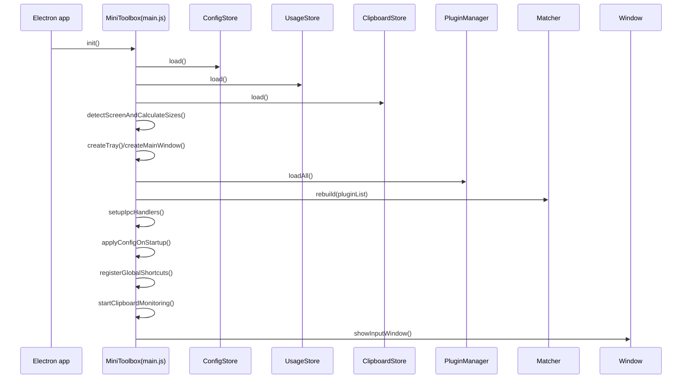
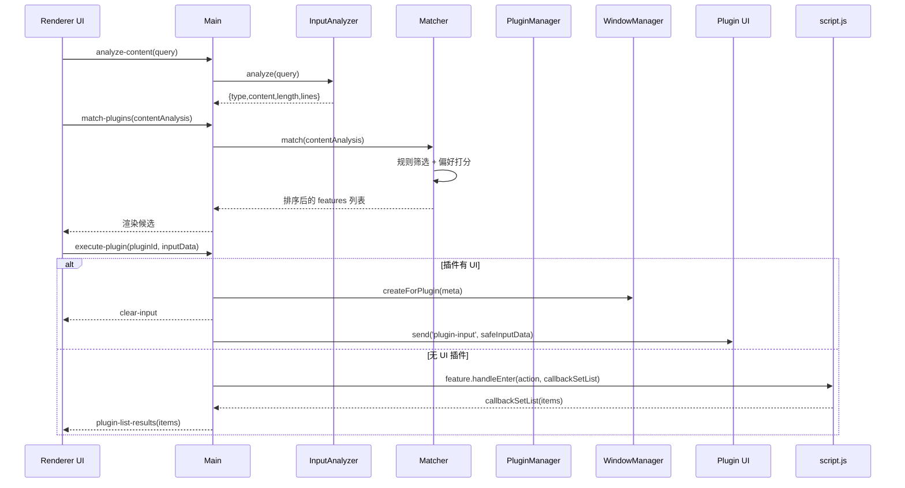
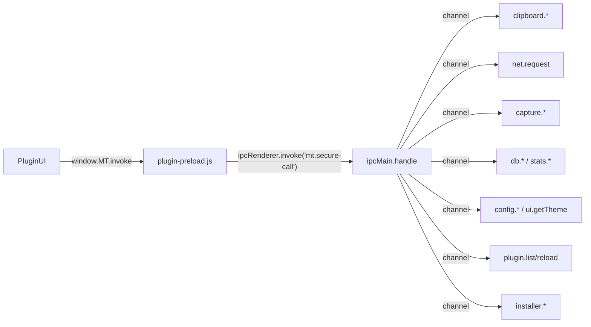
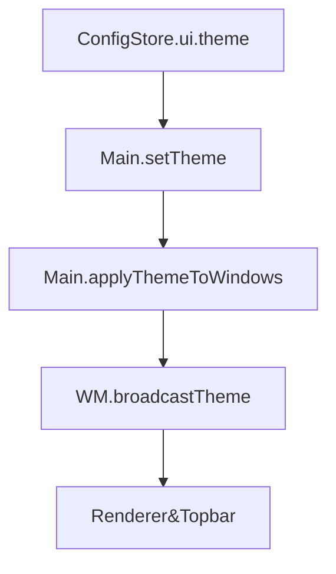
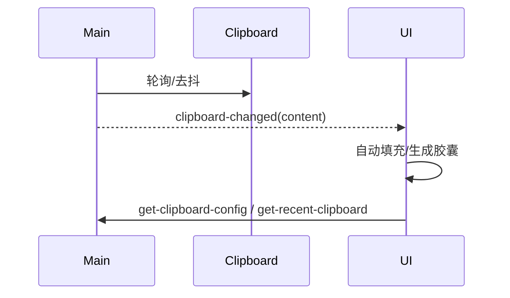
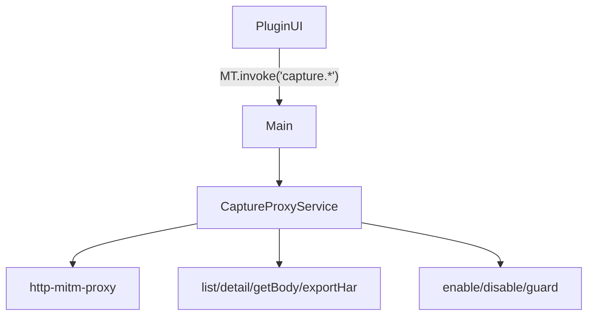

# MiniToolbox

轻量化、可扩展的插件式桌面效率工具。采用“注册-匹配-决策”的架构范式与“Everything is a plugin”的设计哲学，提供统一受限 API 网关与安全沙箱，既开箱即用，又便于二次开发与扩展。

- 平台: Electron (Windows 优先)
- 语言: JavaScript/ES6+
- 入口: `src/main.js`
- 默认语言: 中文简体

---

## 特性亮点
- 一切皆插件: UI 插件与无 UI 插件统一模型，按需多实例/单例
- 注册-匹配-决策: 通过 `features.cmds` 的 `keyword/regex/prefix/files` 精准匹配
- 统一受限 API: 插件仅能通过 `window.MT.invoke('mt.secure-call')` 访问系统能力
- 安全沙箱: 插件窗口 `contextIsolation/sandbox` 开启，禁止直接 Node/FS
- 响应式与主题: 深浅色与 Token 化主题，窗口与控件尺寸随屏幕自适配
- 剪贴板助手: 自动填充、历史记录、文件/图片胶囊一体化体验
- 可观测与日志: 开发期 Dev 日志直出；生产期文件日志，异常集中记录
- 抓包与上游链式代理: 内置 MITM 代理服务，提供 HAR 导出、复放、延迟/改写规则等

---

## 快速开始

```bash
# 安装依赖（会自动重建原生依赖）
npm install

# 开发模式（带控制台日志、渲染端日志转发）
npm run dev

# 生产打包（Windows）
npm run build:win
# 便携版（单文件目录可直接分发）
npm run build:win:portable
```

> 构建注意：使用了 `better-sqlite3`、`http-mitm-proxy` 等原生/二进制依赖。若首次构建失败，请执行 `npm run postinstall` 或 `electron-builder install-app-deps`，并确保 `build.asarUnpack`/`build.files` 已包含对应模块与 .node 文件（见 `package.json`）。

---

## 架构总览（注册-匹配-决策 / 一切皆插件）

```mermaid
flowchart TD
  User[用户输入] --> RUI[Renderer UI \n src/renderer]
  RUI -- ipc.invoke analyze-content/match-plugins --> MAIN[Main Process \n src/main.js]
  MAIN --> IA[InputAnalyzer \n 物理特征识别]
  MAIN --> MATCHER[Matcher \n 规则匹配/打分]
  MATCHER --> RC[RuleCompiler \n features.cmds]
  MATCHER --> US[UsageStore \n 偏好加权]
  MAIN --> PM[PluginManager \n 扫描/清单/ID]
  PM --> PIM[PluginIdManager]
  MAIN --> WM[WindowManager \n 顶栏+内容视图]
  WM --> BW[BrowserWindow + BrowserViews]
  subgraph Plugins[Plugins]
    UIP[UI 插件 index.html]
    HLP[无 UI 插件 script.js]
  end
  BW -->|preload| MT[window.MT \n plugin-preload.js]
  MT -- mt.secure-call --> IPC[ipcMain.handle]
  IPC --> CLIP[ClipboardStore]
  IPC --> CFG[ConfigStore]
  IPC --> DB[DBStore (SQLite)]
  IPC --> CAP[CaptureProxyService]
  IPC --> INS[PluginInstaller]
  IPC --> ICON[IconManager]
  MAIN --> THEME[themeTokens]
```

---

## 核心目录与模块职责

- `src/main.js`: 应用入口；单点初始化窗口/托盘/全局快捷键/IPC；统一调度核心模块
- `src/core/pluginManager.js`: 插件扫描与元信息构建（`plugin.json` → 规则、特性、窗口配置等）
- `src/core/ruleCompiler.js`: 将 `features.cmds` 编译为高效规则（keyword/prefix/regex/files）
- `src/core/matcher.js`: 基于内容与规则的候选筛选、打分与排序（偏好加权）
- `src/core/inputAnalyzer.js`: 仅做基础物理特征识别（文件/图片/视频/音频/...）
- `src/core/windowManager.js`: 插件窗口生命周期与“顶栏 + 内容”双 `BrowserView` 装配
- `src/core/pluginIdManager.js`: 插件 ID 规范化、生成、冲突检测；本地/包/注册中心兼容
- `src/core/pluginInstaller.js`: 插件搜索/安装/卸载/更新（支持本地 .mtpkg）
- `src/core/dbStore.js`: SQLite KV/事件统计（每插件命名空间 + 配额/上限）
- `src/core/clipboardStore.js`: 剪贴板历史（JSON 归一化/类型标注/按时效查询）
- `src/core/usageStore.js`: 使用偏好计数（影响匹配排序）
- `src/core/themeTokens.js`: 主题 Token（dark/light）与语义色/组件 Token 集
- `src/core/captureProxy.js`: 抓包代理与系统代理管理、改写/延迟规则、HAR 导出、复放
- `src/preload/plugin-preload.js`: 将受限 API 暴露为 `window.MT`（插件唯一系统能力入口）
- `src/preload/chrome-preload.js`: 插件顶栏桥接 API（钉住/控制窗口/DevTools）
- `src/plugin-api/api.js`: 老插件兼容层（将 `MiniToolboxAPI/MTAPI` 指向 `window.MT`）
- `src/renderer/*`: 主输入框与结果列表、胶囊 UI、主题应用、自动填充与匹配交互

---

## 启动流程图



---

## 输入匹配与插件执行流程



---

## IPC 受限 API 网关（window.MT → mt.secure-call）



- 插件仅能通过 `window.MT.invoke(channel, payload)` 调用受限能力，禁止直连 Node/FS
- 常用通道：`clipboard.readText/writeText`、`openExternal`、`net.request`、`ui.getTheme`
- DB/Stats 以“插件命名空间 + featureCode 默认 collection”隔离，内置配额与值大小上限

---

## 无 UI 插件交互（列表与选择）

```mermaid
flowchart TD
  UI -- execute-plugin --> Main
  Main -->|require(script.js)| Feature[featureCode]
  Feature -->|handleEnter| Items[callbackSetList(items)]
  Items --> Main --> UI
  UI -- plugin-list-select(item) --> Main --> Feature.handleSelect
  Feature -- action.redirect --> Main.redirectToPlugin --> Main.executePlugin
```

---

## 主题与响应式

- `ConfigStore.ui.theme` 支持 `system/light/dark`；启动与切换时 `applyThemeToWindows()` 广播 `ui-theme`
- `themeTokens.js` 暴露 dark/light 双套 token（语义色/组件 token/动效/间距）
- `detectScreenAndCalculateSizes()` 读取工作区大小，计算窗口/输入框/胶囊/缩略图等尺寸（随屏类型 small/medium/large 自适配）



---

## 剪贴板与胶囊

- 主进程 500ms 轮询剪贴板，变化后通过 `clipboard-changed` 通知渲染端
- 渲染端在聚焦且输入为空时自动填充“最近 N 秒”的剪贴板内容（`get-recent-clipboard`）
- 文件/图片/长文本自动生成“胶囊”，图片即刻异步生成缩略图，JSON 文本单行化存储



---

## 抓包代理与链式上游

- 通过 `capture.*` 通道控制 `CaptureProxyService`：`start/stop/status/list/detail/getBody/exportHar/installCert/...`
- 支持按 host 与 path 前缀过滤、请求/响应头改写、Mock/拦截、延迟规则、HAR 导出、请求复放（cURL/Powershell）
- Windows 支持系统层代理开关/恢复、证书安装/卸载，带自连保护与开机修复



---

## 插件开发概览

- 清单 `plugin.json` 必填；UI 插件应包含 `index.html`，无 UI 插件实现 `script.js`
- `features` 定义功能；`cmds` 支持 `keyword`/`regex`/`prefix`/`files`
- 无 UI 插件处理器约定：
  - `handleEnter(action, callbackSetList)`
  - `handleSelect(action, itemData, callbackSetList)`
  - 可通过 `action.redirect('plugin-id', input)` 跳转到其他插件
- UI 插件窗口尺寸/行为在 `plugin.json.window` 配置（如 `hideOnBlur`）
- 插件访问系统能力：仅通过 `window.MT.invoke('channel', payload)`（见“IPC 受限 API”）

更多请参考：`docs/插件开发安装打包分发使用文档.md`、`docs/插件plugin.json使用方法.md`。

---

## 配置与数据

- 配置存储 `ConfigStore`（`userData/config.json`），提供 UI/窗口/搜索/性能/快捷键等配置项
- 数据存储 `DBStore`（SQLite，`userData/data/data.sqlite`），提供 KV 与事件统计 API：
  - `db.put/get/del/list/count`（默认以最近的 `featureCode` 作为 collection）
  - `stats.inc/range`（分钟/小时/日聚合）
- 使用偏好 `UsageStore`（影响匹配排序），剪贴板历史 `ClipboardStore`（JSON 单行化/类型标注）

---

## 安全模型

- 插件窗口默认启用 `contextIsolation: true`、`sandbox: true`、`nodeIntegration: false`
- 仅通过 `window.MT` 访问系统能力；主进程统一网关 `mt.secure-call` 逐通道鉴权与入参校验
- 所有外部内容展示需转义；URL 必须校验协议（仅 `http/https`）

---

## 日志与排障

- 开发期：`electron --dev` 启用渲染端日志转发与主进程详细日志
- 生产期：`FileLogger` 将 `console.*` 写入 `userData/logs/MiniToolbox-YYYYMMDD.log`（自动轮转）
- 常见问题：
  - better-sqlite3 无法加载：执行 `npm run postinstall`，并确认构建配置包含 `.node` 与 `bindings/*`
  - 打包后插件静态资源：确保 `asarUnpack` 与 `files` 中包含 `plugins/**/*`
  - 抓包证书安装：Windows 依赖 `certutil`；如失败可尝试管理员权限重新安装

---

## 目录结构（关键路径）

```text
src/
  main.js
  core/
    pluginManager.js
    ruleCompiler.js
    matcher.js
    inputAnalyzer.js
    windowManager.js
    pluginIdManager.js
    pluginInstaller.js
    dbStore.js
    clipboardStore.js
    usageStore.js
    captureProxy.js
    themeTokens.js
    iconManager.js
  preload/
    plugin-preload.js
    chrome-preload.js
  plugin-api/
    api.js
  renderer/
    index.html
    renderer.js
    style.css
  ui/
    chrome.html
plugins/
  ... 内置与用户插件示例
```

---

## 开源协议

MIT License © MiniToolbox Team

---

## 致谢

感谢所有为 MiniToolbox 提交反馈与插件的开发者们！

