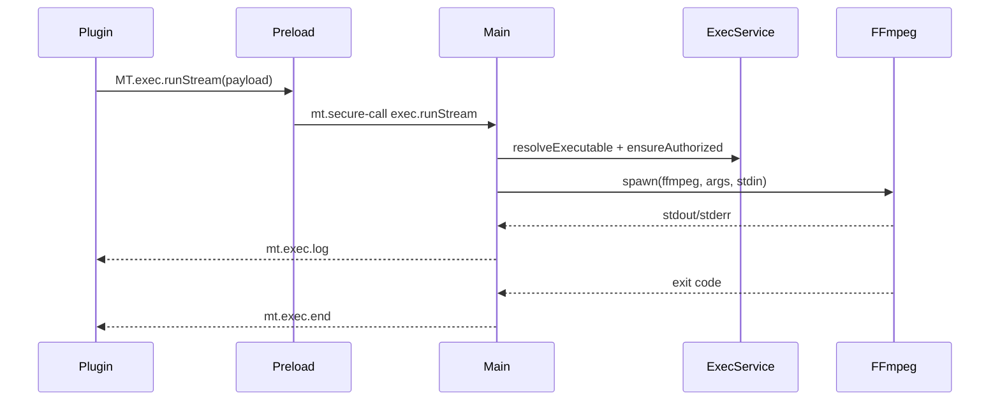

# FFmpeg 支持与使用说明（插件内可执行文件）

本文档总结了 FFmpeg 工具支持的实现、插件目录内可执行文件的执行规则与推荐用法，并给出常见问题的排查指引。

## 执行安全模型（ExecService）

- 仅允许执行“当前插件目录内、且在 `plugin.json.allowExec` 白名单中的可执行文件”。
  - 白名单支持“相对路径”，例如：
    ```json
    {
      "allowExec": ["bin/ffmpeg.exe"]
    }
    ```
  - 执行时传入的 `name` 可以是相对路径或同名 basename；若白名单中同名项只有一个，会自动匹配。
- 路径严控：主进程会将相对路径解析到插件目录内，禁止越界访问。
- 首次授权：首次执行时会弹出确认（仅一次/本会话/总是允许）。“总是允许”会写入 `security.execPermissions.always`。
- 进程限制：`shell:false`、`windowsHide:true`、并发/超时限制（默认 15 分钟，可传 `timeoutMs`，上限 60 分钟）。
- 两种调用方式：
  - `MT.exec.run(payload)`：同步等待结束，返回 `{ code, timeout, stdout, stderr }`。
  - `MT.exec.runStream(payload, { onLog, onEnd })`：流式返回日志（推荐用于长任务或需要进度显示）。

### 典型调用（流式）

```js
const payload = { name: 'bin/ffmpeg.exe', args: ['-y','-hide_banner','-i','in.mp4','-c','copy','out.mp4'], timeoutMs: 30*60*1000 };
const rt = await window.MT.exec.runStream(payload, {
  onLog: (msg) => { /* msg = { taskId, stream: 'stdout'|'stderr', text } */ },
  onEnd: (msg) => { /* msg = { taskId, code } */ }
});
```

## FFmpeg 插件功能与规则

### 检测 ffmpeg 可执行

- 插件使用 `MT.invoke('exec.check')` 检查白名单中的相对路径是否存在，返回 `[{ name, exists }]`。
- 面板顶部显示“ffmpeg 就绪/未检测到”。

### 合并（concat）

- 支持音频（mp3/m4a/wav）与视频容器。
- 中文/空格路径采用 ffconcat 清单通过 stdin 输入，避免编码问题：
  - 命令关键参数：`-protocol_whitelist file,pipe,crypto,data -f concat -safe 0 -i -`。
  - 清单格式（无 BOM，LF 换行）：
    ```
    ffconcat version 1.0
    file 'C:/path/a.mp3'
    file 'C:/path/b.mp3'
    ```
  - 音频合并：`-map 0:a:0 -c:a copy`（wav 需 `-c:a pcm_s16le`）。

### 转码/重封装/截取 输出命名策略（避免就地覆盖）

- 若输出格式与源格式相同，自动在文件名加后缀，避免 in-place 报错：
  - 重封装 remux：`.remux`
  - 转码 transcode：`.hevc`（当 `libx265`）或 `.transcoded`
  - 截取 trim：`.cut`
- 若输出格式不同，则直接改后缀。

### UI 调整

- 列表仅展示文件名（完整路径在悬停提示）。
- “选择目录”即自动加载该目录所有媒体文件。
- 移除“输出目录”选项：默认写回源目录（或合并时用户选择的输出文件）。
- 实时日志：logs 面板实时显示 FFmpeg stdout/stderr。

## 常见问题与排查

- “FFmpeg cannot edit existing files in-place”
  - 已通过自动加后缀解决；若仍报错，确认目标路径可写且未被占用。
- “unknown keyword 'ffconcat'”
  - 清单前面存在 BOM，已改为无 BOM；若自己构造清单，注意无 BOM、LF 换行。
- “Protocol 'file' not on whitelist”
  - 已添加 `-protocol_whitelist file,pipe,crypto,data`。
- 仍未写出文件
  - 查看 logs 面板的 stderr；若是权限/路径问题，请确认目标目录可写，路径未被系统或杀软阻止。

## 调用流程示意




