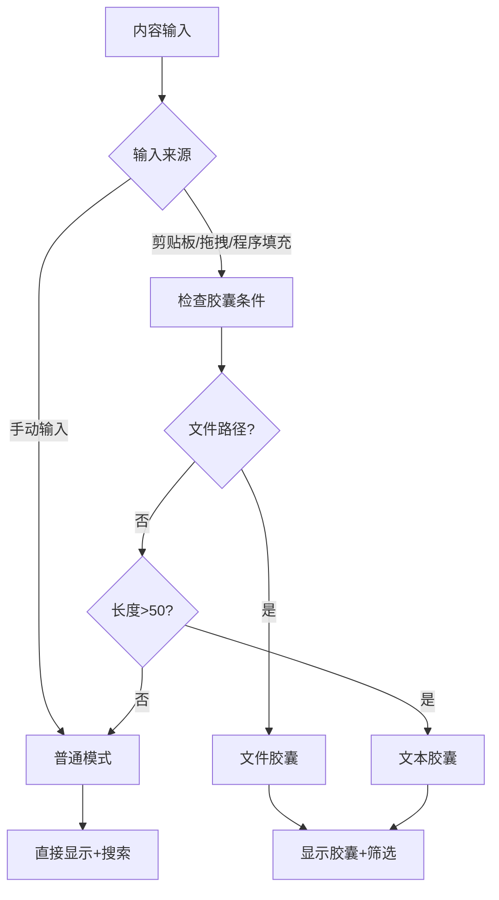
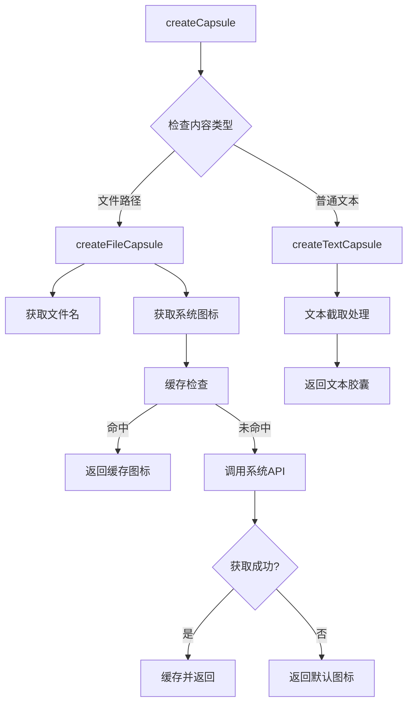
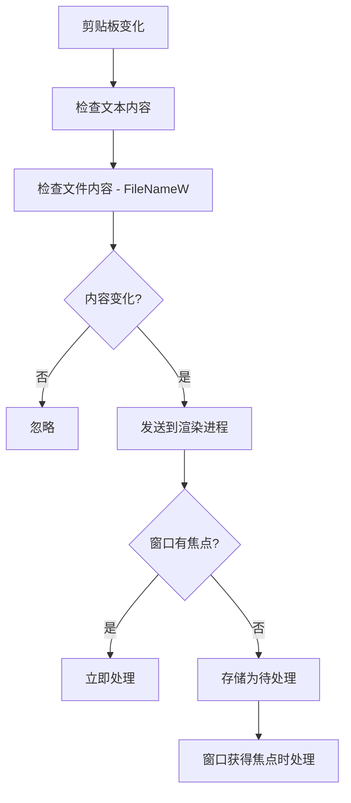

# 内容胶囊功能实现指南

## 项目概述

本文档详细记录了MiniToolbox内容胶囊功能的完整实现过程，包括技术细节、代码执行时序、业务逻辑流程以及遇到的问题和解决方案。

## 核心需求分析

### 1. 问题背景
- **输入框灵活性不足**：大文本时无法进一步筛选插件
- **多行文本显示问题**：换行文本占满整个输入框，不能点击
- **文件路径显示不友好**：图片/文件复制显示为路径形式

### 2. 解决方案
将后台输入内容封装成"胶囊"对象，在输入框内部显示压缩版本，保留空间供用户继续输入筛选文本。

## 技术架构设计

### 1. 分层架构

```
┌─────────────────┐
│   UI层 (CSS)    │ ← 胶囊样式、主题适配
├─────────────────┤
│ 渲染层 (JS)     │ ← 胶囊逻辑、事件处理
├─────────────────┤
│ 主进程层        │ ← 剪贴板监听、图标获取
├─────────────────┤
│ 核心模块层      │ ← 文件分析、图标管理
└─────────────────┘
```

### 2. 核心模块

#### 2.1 InputAnalyzer (文件类型检测)
- **职责**：识别文件路径、检测文件类型
- **位置**：`src/core/inputAnalyzer.js`
- **关键方法**：
  - `analyze(content)` - 内容分析入口
  - `isFilePath(content)` - 文件路径检测
  - `getFileCategory(filePath)` - 文件分类
  - `isNonTextFile(filePath)` - 非文本文件判断

#### 2.2 IconManager (图标管理)
- **职责**：系统图标获取、缓存管理
- **位置**：`src/core/iconManager.js`
- **关键方法**：
  - `getFileIcon(filePath)` - 图标获取入口
  - `getWindowsIcon(filePath, ext)` - Windows图标获取
  - `setCachedIcon(key, iconData)` - 图标缓存
  - `getDefaultIcon(category)` - 默认图标获取

#### 2.3 胶囊渲染器 (MiniToolboxRenderer)
- **职责**：胶囊UI渲染、交互处理
- **位置**：`src/renderer/renderer.js`
- **关键方法**：
  - `shouldShowCapsule(content, isManualInput)` - 胶囊触发判断
  - `createCapsule(content)` - 胶囊创建
  - `showCapsule(capsuleData)` - 胶囊显示
  - `updateCapsuleContent(newContent)` - 胶囊内容更新

## 业务逻辑流程

### 1. 内容输入流程



### 2. 胶囊创建流程



### 3. 剪贴板监听流程



## 代码执行时序

### 1. 应用启动时序

```
1. 主进程初始化
   ├── IconManager 实例化
   ├── InputAnalyzer 实例化
   └── 剪贴板监听启动

2. 渲染进程初始化
   ├── DOM 元素绑定
   ├── 事件监听器设置
   └── 胶囊相关元素初始化

3. IPC 通道建立
   ├── get-file-icon 处理器
   ├── analyze-content 处理器
   └── clipboard-changed 监听器
```

### 2. 胶囊显示时序

```
1. 内容输入 (setContent)
   ├── 触发条件检查 (shouldShowCapsule)
   └── 胶囊创建 (createCapsule)

2. 文件胶囊创建
   ├── 文件路径解析
   ├── IPC调用: get-file-icon
   ├── 主进程: IconManager.getFileIcon
   ├── 系统API调用 (app.getFileIcon)
   └── 结果返回渲染进程

3. 胶囊显示
   ├── DOM 元素更新
   ├── CSS 类添加 (file-capsule/text-capsule)
   ├── 图标渲染 (native/emoji)
   └── 事件监听器绑定
```

### 3. 编辑交互时序

```
1. 用户点击编辑图标
   ├── 类型检查 (只有文本胶囊可编辑)
   └── 显示编辑区域 (showEditArea)

2. 编辑过程
   ├── 保持胶囊显示状态
   ├── 编辑区域内容填充
   └── 插件列表隐藏

3. 保存操作
   ├── 内容验证
   ├── 胶囊数据更新 (updateCapsuleContent)
   ├── 胶囊显示刷新
   └── 编辑区域隐藏

4. 取消操作
   ├── 保持原胶囊内容
   └── 编辑区域隐藏
```

## 技术实现细节

### 1. 文件路径检测

```javascript
// 文件路径识别正则表达式
const filePaths = [
  /^[a-zA-Z]:[\\\/]/,                    // Windows: C:\
  /^\/[^\/]/,                            // Unix: /home
  /^\.{1,2}[\\\/]/,                     // 相对路径: ./ ../
  /^\\\\[^\\]/,                         // UNC: \\server
  /[\\\/].*\.[a-zA-Z0-9]{1,10}$/        // 包含路径分隔符且有扩展名
];
```

### 2. 剪贴板文件检测

```javascript
// Windows 文件复制检测
const buffer = clipboard.readBuffer('FileNameW');
if (buffer && buffer.length > 2) {
  const filePath = buffer.toString('ucs2').replace(/\0/g, '').trim();
  // 验证文件路径有效性
  if (filePath && 
      filePath.length > 3 && 
      (filePath.includes('\\') || filePath.includes('/')) &&
      filePath.includes('.')) {
    // 处理文件路径
  }
}
```

### 3. 图标缓存机制

```javascript
// LRU 缓存实现
setCachedIcon(key, iconData) {
  if (this.cache.size >= this.maxCacheSize) {
    const firstKey = this.cache.keys().next().value;
    this.cache.delete(firstKey);
  }
  this.cache.set(key, iconData);
}
```

### 4. 胶囊样式系统

```css
/* 基础胶囊样式 */
.content-capsule {
  max-width: 30%;
  height: 80%;
  background: var(--mt-hover);
  border: 1px dashed var(--mt-border);
  border-radius: 8px;
}

/* 文件胶囊 - 实线边框 */
.content-capsule.file-capsule {
  border-style: solid;
}

/* 文本胶囊 - 虚线边框 */
.content-capsule.text-capsule {
  border-style: dashed;
}
```

## 关键技术决策

### 1. 胶囊触发条件
- **手动输入**：不触发胶囊，保持传统输入体验
- **外部来源** + **长度>50** 或 **文件路径**：触发胶囊模式
- **文件路径**：立即触发，无长度限制

### 2. 图标获取策略
- **优先级**：系统原生图标 > Emoji默认图标
- **缓存策略**：扩展名级别缓存，最大50个，重启清除
- **降级机制**：获取失败时自动使用默认图标

### 3. 编辑权限控制
- **文本胶囊**：可编辑，点击图标进入编辑模式
- **文件胶囊**：不可编辑，图标半透明显示
- **编辑状态**：保持胶囊显示，不清空界面

### 4. 搜索逻辑分离
- **胶囊内容**：用于插件匹配分析
- **用户输入**：用于插件名称/描述筛选
- **非文本文件**：不参与内容分析，只做插件过滤

## 性能优化措施

### 1. 图标缓存
- **缓存粒度**：按文件扩展名缓存
- **缓存大小**：限制50个图标
- **缓存策略**：LRU淘汰算法
- **内存控制**：重启时自动清除

### 2. 防重复请求
- **请求去重**：同一扩展名的并发请求合并
- **异步处理**：图标获取不阻塞UI渲染
- **错误处理**：获取失败时快速降级

### 3. 剪贴板优化
- **变化检测**：内容和文件路径双重检测
- **防抖处理**：避免重复处理相同内容
- **焦点优化**：窗口失焦时延迟处理

## 问题解决记录

### 1. 剪贴板重复检测
**问题**：文件复制后控制台大量重复日志
**原因**：剪贴板监听器没有正确的变化检测
**解决**：添加文件内容缓存，对比变化后再处理

### 2. 胶囊布局错误
**问题**：图标在文件名后面，不符合需求
**原因**：HTML结构中元素顺序错误
**解决**：调整HTML结构，图标在前，文件名在后

### 3. 快捷方式图标获取失败
**问题**：.lnk文件无法获取正确图标
**原因**：Windows快捷方式文件的图标获取API不稳定
**解决**：简化逻辑，获取失败时使用默认🔗图标

### 4. 窗口隐藏时胶囊残留
**问题**：窗口隐藏后再打开，上次的胶囊仍然存在
**原因**：窗口隐藏时没有清理胶囊状态
**解决**：在所有窗口隐藏事件中添加clearContent()调用

### 5. 编辑模式状态错乱
**问题**：编辑时胶囊消失，保存后状态不一致
**原因**：编辑模式下错误地隐藏了胶囊
**解决**：编辑时保持胶囊显示，保存时更新胶囊内容

## 安全性考虑

### 1. Content Security Policy
```html
<meta http-equiv="Content-Security-Policy" 
      content="default-src 'self' 'unsafe-inline' data:; 
               script-src 'self' 'unsafe-eval'; 
               img-src 'self' data: blob:;">
```

### 2. 文件访问控制
- 文件存在性检查
- 权限验证
- 路径遍历防护
- 临时文件安全清理

## 测试覆盖

### 1. 功能测试
- ✅ 文本胶囊显示和编辑
- ✅ 文件胶囊显示（各种文件类型）
- ✅ 剪贴板集成
- ✅ 拖拽文件处理
- ✅ 系统图标获取
- ✅ 主题适配

### 2. 边界情况测试
- ✅ 超长文件名处理
- ✅ 特殊字符文件名
- ✅ 不存在文件路径
- ✅ 权限不足文件
- ✅ 网络路径处理
- ❌ 多文件拖拽（未实现）

### 3. 性能测试
- ✅ 大量文件图标缓存
- ✅ 频繁剪贴板变化
- ✅ 内存使用监控
- ❌ 并发压力测试（待完成）

## 后续优化方向

### 1. Phase 3: 图片胶囊
- 图片缩略图生成
- 大文件检测和处理
- 内存使用优化

### 2. 用户体验提升
- 胶囊切换动画
- 加载状态指示
- 错误状态显示
- 快捷键支持

### 3. 跨平台完善
- macOS图标获取优化
- Linux图标主题支持
- 路径格式兼容性

### 4. 性能监控
- 图标获取耗时统计
- 内存使用分析
- 错误率监控
- 用户行为分析

## 技术债务

1. **代码重构**：部分方法过于复杂，需要拆分
2. **错误处理**：需要更细致的错误分类和处理
3. **单元测试**：核心逻辑缺少自动化测试
4. **文档更新**：API文档需要同步更新
5. **国际化**：错误信息和界面文本需要国际化支持

## 总结

内容胶囊功能的实现经历了从简单的文本处理到复杂的文件系统集成的演进过程。通过分层架构设计、合理的缓存策略和完善的错误处理，最终实现了一个稳定可靠的用户界面增强功能。

关键成功因素：
1. **清晰的需求分析**和分阶段实现
2. **模块化的架构设计**便于维护和扩展
3. **完善的错误处理**和降级机制
4. **持续的问题解决**和优化改进

该功能显著提升了用户在处理长文本和文件时的使用体验，为后续的功能扩展奠定了良好的基础。
