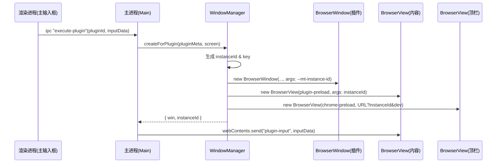
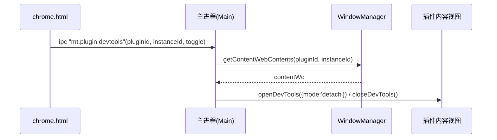
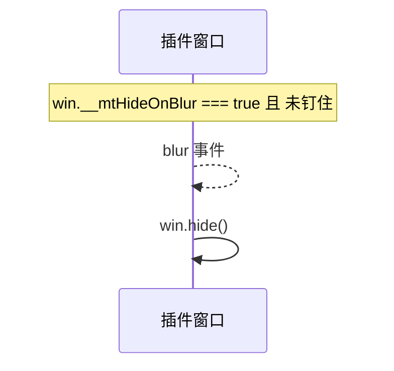
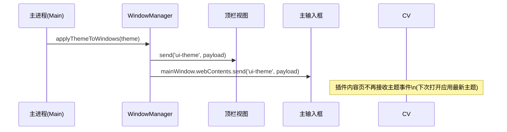

## 概览

本次改造目标：

- 支持插件窗口“单例/多实例”可配置，默认多实例。
- 支持窗口失焦隐藏可配置，默认不隐藏。
- Dev 模式在顶栏（chrome.html）增加“开发者工具”按钮，并指向插件内容视图。
- 简化主题广播：不再向插件内容页广播主题事件，仅顶栏/主输入框即时换肤，插件下次打开即应用最新主题。


## 配置规范（plugin.json）

- 实例模式
  - 字段：`instance`（推荐）或兼容 `multiInstance`
  - 取值：`"single" | "multi"`
  - 默认：`multi`
  - 示例：

```json
{
  "name": "JSON 格式化",
  "instance": "multi"
}
```

- 失焦隐藏
  - 字段：`window.hideOnBlur`
  - 取值：`true | false`
  - 默认：`false`（不自动隐藏）
  - 示例：

```json
{
  "name": "JSON 格式化",
  "window": { "width": 800, "height": 700, "hideOnBlur": true }
}
```


## 架构改动

- WindowManager（`src/core/windowManager.js`）
  - 由 `pluginId -> window` 改为按“实例键”管理：`key = pluginId#instanceId`，单例时 key 直接为 `pluginId`。
  - 映射新增：
    - `pluginIdToInstanceKeys: Map<string, Set<string>>`
    - `webContentsToInstanceKey: Map<number, string>`
  - 将 `--mt-instance-id` 注入到插件内容视图和顶栏，顶栏 URL 增加 `?instanceId=...&dev=0|1`。
  - 钩子：
    - `getContentWebContents(pluginId, instanceId?)` 定位到具体实例内容视图。
    - `setChromeHeight(pluginId, height, instanceId?)` 支持按实例/全体应用。
    - `broadcastTheme` 仅向顶栏发送，不再向插件内容视图发送。
  - 失焦行为：`win.__mtHideOnBlur = (window.hideOnBlur === true)`；blur 时仅在未钉住且开启该选项时隐藏。

- PluginManager（`src/core/pluginManager.js`）
  - 默认 `instanceMode = 'multi'`。
  - 默认 `window.hideOnBlur = false`。

- Main（`src/main.js`）
  - 所有与插件窗口相关的 IPC 增加 `instanceId`：
    - `mt.plugin.pin` / `mt.plugin.win` / `mt.plugin.devtools`。
  - `mt.plugin.devtools` 的目标切换为“插件内容视图”的 webContents（Sources 显示插件源码）。
  - `mt.secure-call`：`plugin.list`/`plugin.reload` 返回 `instanceMode`。
  - `createPluginWindow` 兼容旧调用（返回 BrowserWindow）与新结构（返回对象）。

- Preload
  - `plugin-preload.js`：从 `additionalArguments` 读取 `--mt-instance-id`，所有 IPC 和 secure-call 携带 `instanceId`。
  - `chrome-preload.js`：所有窗口控制 API 携带 `pluginId+instanceId`。
  - `chrome.html`：
    - Dev 环境显示“开发者工具”按钮，点击前自动钉住该实例，避免 `hideOnBlur=true` 时 DevTools 触发失焦隐藏。
    - DevTools 通过 `mt.plugin.devtools` 打开“插件内容视图”的面板。


## 运行时流程（关键路径）

### 打开有 UI 插件（多实例）



### 顶栏点击 DevTools（仅 Dev）



### 失焦自动隐藏



### 主题变更




## 影响与兼容性

- 兼容旧插件：不修改即可运行；默认改为多实例与失焦不隐藏。
- 若希望单例：在 `plugin.json` 设置 `"instance":"single"`。
- 若希望开启失焦隐藏：在 `plugin.json` 设置 `"window":{"hideOnBlur": true}`。
- 主题：主输入框/顶栏即时换肤；插件内容页不再接收主题事件，避免冗余刷新。


## 常见问题

- DevTools 打开为空白？
  - 已将目标切换为“插件内容视图”的 webContents；如仍为空，请确认插件 `index.html` 正常加载。
- 打开 DevTools 导致窗口消失？
  - 顶栏按钮会先自动钉住该实例再打开 DevTools；也可在 `plugin.json` 关闭 `hideOnBlur`。


