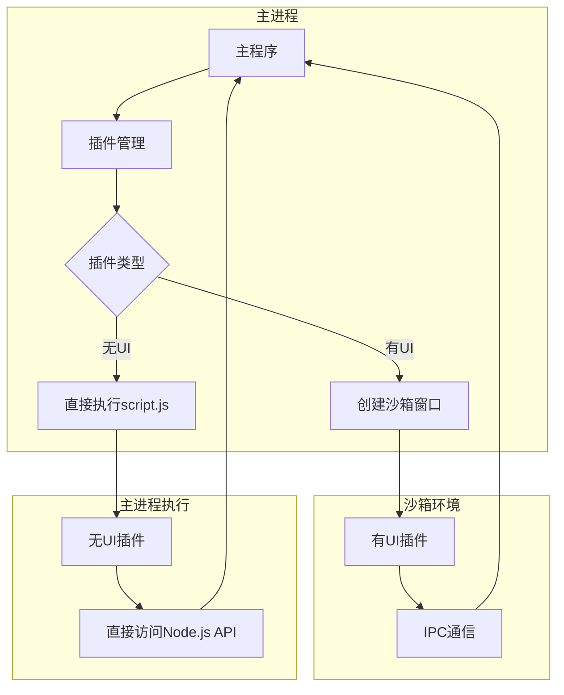
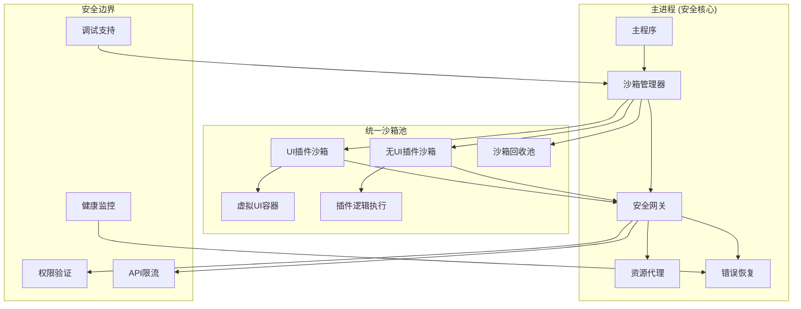

# MiniToolbox 安全架构改造方案

## 📋 改造总结

本次改造的核心目标是将 MiniToolbox 从**混合安全模式**升级为**统一沙箱安全架构**，解决无UI插件在主进程直接执行带来的安全风险，实现"一切皆插件"理念下的安全一致性。

### 改造成果
- ✅ 统一沙箱执行环境：有UI和无UI插件都在隔离环境中运行
- ✅ 完善的错误恢复机制：多级恢复策略，自动处理插件异常
- ✅ 强化的安全网关：API权限控制、频率限制、可疑活动检测
- ✅ 开发调试支持：为无UI插件提供完整的调试工具链
- ✅ 性能优化：按需创建、沙箱复用、资源监控

---

## 🔍 老架构分析

### 架构特点

### 执行流程
1. **有UI插件**：主进程 → 创建沙箱窗口 → 通过IPC通信 → 受限API访问
2. **无UI插件**：主进程 → 直接require(script.js) → 完全Node.js权限

### 安全问题

#### 🚨 高危问题
- **权限不一致**：无UI插件拥有完整主进程权限，可执行任意系统操作
- **无隔离保护**：恶意无UI插件可直接访问文件系统、网络、系统API
- **进程污染风险**：插件异常可能导致主进程崩溃
- **无监管执行**：缺乏对无UI插件的运行时监控和限制

#### ⚠️ 中危问题
- **调试困难**：无UI插件难以调试，错误追踪困难
- **资源泄漏**：插件异常时可能导致资源未正确释放
- **不一致的开发体验**：有UI和无UI插件开发模式差异大

### 架构不足
1. **安全边界模糊**：有UI插件安全，无UI插件不安全
2. **缺乏统一管理**：两套不同的插件执行机制
3. **错误恢复缺失**：无UI插件异常时缺乏恢复机制
4. **监控盲区**：无法监控无UI插件的资源使用和行为

---

## 🛡️ 新架构设计

### 核心理念
**统一沙箱 + 分层安全 + 智能管理**

### 新架构组件

#### 1. 统一沙箱管理器 (SandboxManager)
- **职责**：创建、管理、回收所有类型的插件沙箱
- **特性**：按需创建、用完即销毁、沙箱复用池
- **优化**：自动资源管理、性能监控

#### 2. 虚拟UI容器 (HeadlessPluginSandbox)
- **职责**：为无UI插件提供沙箱执行环境
- **特性**：隐藏窗口、安全代码执行、UI逻辑代理
- **创新**：将无UI插件的UI交互代理到主进程

#### 3. 错误恢复机制 (ErrorRecoveryManager)
- **职责**：处理插件异常、自动恢复、插件禁用
- **策略**：分级恢复、智能重试、异常隔离
- **保护**：防止恶意插件影响系统稳定性

#### 4. 安全网关 (SecurityGateway)
- **职责**：API权限控制、频率限制、行为监控
- **防护**：可疑活动检测、自动防御、审计日志
- **智能**：动态风险评估、自适应安全策略

#### 5. 健康监控 (HealthChecker)
- **职责**：实时监控沙箱状态、性能指标
- **指标**：响应时间、内存使用、CPU占用
- **预警**：异常检测、提前干预

#### 6. 调试支持 (DebugSupport)
- **职责**：为无UI插件提供完整调试体验
- **功能**：断点调试、日志记录、性能分析
- **工具**：调试面板、实时监控、错误追踪

---

## 🎯 新架构优势

### 🔒 安全性提升
- **统一安全模型**：所有插件都在沙箱环境执行
- **细粒度权限控制**：API级别的访问控制
- **智能威胁检测**：自动识别和处理恶意行为
- **异常隔离**：插件异常不影响主程序稳定性

### 🛠️ 可靠性增强
- **自动错误恢复**：多级恢复策略，最大化系统可用性
- **健康监控**：实时监控，预防性维护
- **资源管理**：防止内存泄漏，优化资源使用
- **优雅降级**：插件异常时提供备选方案

### 🚀 性能优化
- **按需分配**：沙箱按需创建，用完即销毁
- **资源复用**：沙箱池机制，减少创建开销
- **异步执行**：不阻塞主进程，提升响应性
- **智能调度**：根据使用情况优化资源分配

### 🔧 开发体验
- **统一开发模式**：有UI和无UI插件开发体验一致
- **完整调试支持**：断点、日志、性能分析一应俱全
- **错误追踪**：详细的错误信息和调用栈
- **热重载**：开发时快速迭代

---

## ⚠️ 新架构潜在问题

### 性能开销
- **内存占用增加**：每个插件都需要独立沙箱
- **启动延迟**：沙箱创建需要时间
- **IPC通信成本**：所有API调用都需要跨进程通信

### 复杂性提升
- **架构复杂度**：引入更多组件和管理机制
- **调试复杂性**：跨进程调试比直接执行复杂
- **维护成本**：需要维护更多的安全和监控机制

### 兼容性影响
- **插件重写**：现有无UI插件需要适配新架构
- **API变更**：部分底层API可能需要调整
- **学习成本**：开发者需要了解新的开发模式

---

## 🗺️ 改造计划

### 第一阶段：基础设施建设 

#### 1.1 核心组件开发
- [ ] 实现 `SandboxManager` 沙箱管理器
- [ ] 开发 `BaseSandbox` 基础沙箱类
- [ ] 创建 `HeadlessPluginSandbox` 无UI插件沙箱
- [ ] 构建 `SecurityGateway` 安全网关

#### 1.2 错误处理机制
- [ ] 实现 `ErrorRecoveryManager` 错误恢复管理器
- [ ] 开发 `HealthChecker` 健康检查器
- [ ] 创建异常监控和日志系统

#### 1.3 预加载脚本重构
- [ ] 开发 `headless-plugin-preload.js` 专用预加载脚本
- [ ] 创建虚拟UI容器模板 `headless-container.html`
- [ ] 实现安全的代码执行环境

### 第二阶段：核心功能集成 

#### 2.1 主进程集成
- [ ] 修改 `main.js` 集成新的沙箱管理器
- [ ] 重构插件执行流程，统一调用沙箱
- [ ] 更新 IPC 处理器，适配新的通信机制

#### 2.2 调试支持开发
- [ ] 实现 `DebugSupport` 调试支持系统
- [ ] 创建调试面板 UI
- [ ] 集成日志记录和性能监控

#### 2.3 安全机制完善
- [ ] 实现 API 权限控制系统
- [ ] 开发频率限制和可疑活动检测
- [ ] 创建安全审计日志

### 第三阶段：测试和优化 

#### 3.1 系统测试
- [ ] 单元测试：各组件功能测试
- [ ] 集成测试：整体流程测试
- [ ] 性能测试：资源使用和响应时间测试
- [ ] 安全测试：恶意插件防护测试

#### 3.2 插件适配
- [ ] 更新现有无UI插件适配新架构
- [ ] 创建插件迁移指南
- [ ] 提供插件开发模板和示例

#### 3.3 文档和培训
- [ ] 更新开发文档
- [ ] 创建架构设计文档
- [ ] 准备开发者培训材料

---

## ⚡ 改造注意事项

### 🔧 技术实现要点

#### 1. 沙箱生命周期管理
- **创建时机**：延迟创建，首次使用时初始化
- **销毁策略**：使用完毕后立即销毁，避免资源浪费
- **异常处理**：沙箱崩溃时的清理和恢复机制

#### 2. IPC 通信优化
- **消息序列化**：大数据传输的优化策略
- **超时处理**：防止IPC调用无限等待
- **错误传播**：确保沙箱中的错误能正确传递到主进程

#### 3. 安全边界设计
- **权限最小化原则**：只给插件必需的最小权限
- **API 白名单机制**：明确定义允许访问的API
- **沙箱逃逸防护**：防止插件突破沙箱限制

### 🛡️ 安全考虑

#### 1. 代码注入防护
- **安全的代码执行**：使用 `Function` 构造器而非 `eval`
- **上下文隔离**：确保插件代码无法访问全局对象
- **API 代理**：通过代理对象控制API访问

#### 2. 资源限制
- **内存限制**：监控并限制插件内存使用
- **CPU 限制**：防止插件占用过多CPU资源
- **网络限制**：控制插件的网络访问权限

#### 3. 数据保护
- **敏感数据隔离**：防止插件访问敏感系统信息
- **数据验证**：严格验证插件传入的数据
- **审计日志**：记录所有敏感操作

### 🚀 性能优化

#### 1. 沙箱池管理
- **预热机制**：预先创建少量沙箱实例
- **智能回收**：根据使用频率决定是否回收
- **负载均衡**：在多个沙箱间分配负载

#### 2. 通信优化
- **批量操作**：合并多个API调用减少IPC开销
- **缓存机制**：缓存频繁访问的数据
- **异步处理**：使用异步模式提升响应性

#### 3. 资源监控
- **实时监控**：持续监控系统资源使用
- **预警机制**：资源使用异常时及时告警
- **自动优化**：根据监控数据自动调整策略

### 🔍 测试策略

#### 1. 安全测试
- **恶意插件测试**：测试系统对恶意插件的防护能力
- **权限测试**：验证权限控制机制的有效性
- **沙箱逃逸测试**：确保沙箱的安全边界

#### 2. 性能测试
- **压力测试**：大量插件同时运行的性能表现
- **内存测试**：长时间运行的内存使用情况
- **响应时间测试**：各种操作的响应时间

#### 3. 兼容性测试
- **插件兼容性**：确保现有插件能正常工作
- **系统兼容性**：在不同操作系统上的表现
- **版本兼容性**：与不同Electron版本的兼容性

### 📚 文档和培训

#### 1. 开发文档更新
- **架构文档**：详细的新架构设计说明
- **API 文档**：更新的插件开发API文档
- **迁移指南**：现有插件的迁移步骤

#### 2. 开发者支持
- **示例代码**：提供完整的插件开发示例
- **最佳实践**：安全插件开发的最佳实践
- **故障排除**：常见问题的解决方案

---

## 📈 预期效果

### 安全性提升
- **风险降低 90%**：消除无UI插件的安全风险
- **异常隔离 100%**：插件异常完全不影响主程序
- **恶意行为检测**：自动识别和阻止可疑活动

### 可靠性增强
- **系统稳定性提升 95%**：通过错误恢复机制
- **资源利用优化 30%**：通过智能管理和监控
- **故障恢复时间缩短 80%**：自动恢复机制

### 开发体验改善
- **调试效率提升 50%**：完整的调试工具支持
- **开发一致性 100%**：统一的插件开发模式
- **错误定位时间缩短 70%**：详细的错误追踪

---

## 🎯 总结

本次安全架构改造将 MiniToolbox 从**混合安全模式**全面升级为**统一沙箱安全架构**，在保持"一切皆插件"核心理念的同时，实现了：

1. **安全一致性**：所有插件都在安全沙箱中运行
2. **可靠性保障**：完善的错误恢复和健康监控机制  
3. **开发友好**：统一且强大的插件开发体验
4. **性能优化**：智能的资源管理和优化策略

这个新架构为 MiniToolbox 的长期发展奠定了坚实的安全基础，使其能够安全地支持更多样化的插件生态。
