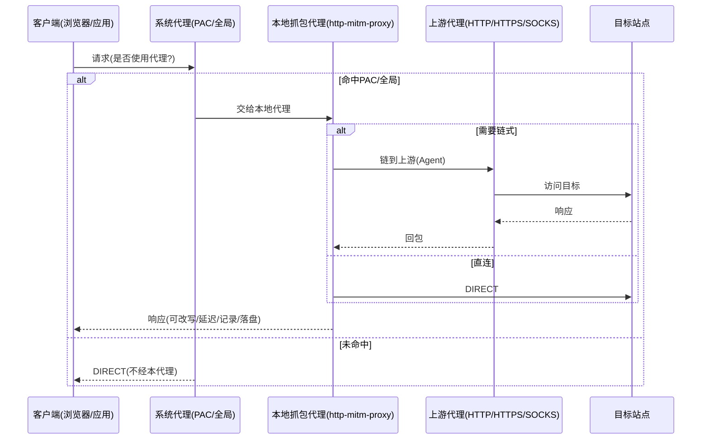

## 概览

本指南整合并取代《链式代理实现与性能总结》《抓包插件-架构与实现说明》。内容涵盖：系统架构、链式上游代理（HTTP/HTTPS/SOCKS）、PAC/全局两种系统接入方式、抓包与改写能力、数据存储、状态与守护、常见排障与实践建议。适配本仓主分支的最新实现（以 `src/core/captureProxy.js` 为准）。

## 目标与原则

- 目标：实现“注册-匹配-决策”架构下的系统级 HTTP/HTTPS 抓包，并支持把进入本代理的流量继续链式转发至上游代理（如 V2rayN）。
- 原则：一切皆插件；受限 API 通过 `window.MT.invoke('mt.secure-call', ...)` 访问；异步优先、可观测日志、沙箱与最小权限。
- 语言与安全：ES6+；错误 `try/catch`；页面/插件注意 XSS 转义；URL 只允许 http/https。

## 总体架构

- 主进程服务：`src/core/captureProxy.js`
  - 启动本地 MITM 代理（默认 `127.0.0.1:8888`，端口占用自动递增）。
  - 证书中心（CA）与每域证书签发；HTTPS 解密。
  - 代理层过滤：可按“目标域/通配/路径前缀”决定是否进入抓包记录链路（不命中时透传不入库）。
  - 记录链路：请求/响应头与正文（小体内联，大体落盘）；解压 gzip/deflate/br；JSON 自动美化。
  - 系统代理（Windows）开关与 PAC：注册表写入 + PowerShell 兜底 + InternetSetOption 广播。
  - 链式上游代理：在本地代理之后，继续转发到上游 HTTP/HTTPS/SOCKS 代理（如 V2rayN）。

- 渲染/插件：`plugins/http-sniffer`（UI 与交互）
  - 启停、本地/系统状态显示、列表与详情、cURL 复制、请求重放、HAR 导出。
  - 设置面板：上游开关/地址、PAC 或全局、目标域与路径前缀、改写/Mock 规则、落盘配额等。

## 核心数据流

要点：PAC/全局仅决定“是否进入本代理”；进入后是否走上游由本代理内部决定并强制执行（除本地/绕过域）。

## 链式上游代理

### 参数与来源

- `capture.start({ upstream })`
  - `'system'`：自动读取 Windows 系统代理（优先使用安装本工具前的备份 original.server），并据端口/显式协议判断 HTTP/HTTPS/SOCKS。
  - 显式对象：`{ http, https, bypass }` 或单一 URL，如 `socks5://127.0.0.1:10808`。

### 最新行为变更（重要）

- 仅当一次请求“实际使用了上游”且发生网络错误（ECONNREFUSED/ETIMEDOUT/...）时，才进行 15s 熔断，避免把直连失败误判为上游故障。
- 使用 `'system'` 时“不再继承系统 ProxyOverride”，以避免在家庭网络环境（直连外网不可达）下被大范围绕过；本代理仅保留最小必要绕过（如 localhost），PAC/全局层面继续由用户控制范围。
- CONNECT 阶段支持：为 HTTPS 建链在 `onConnect`/`onRequest` 均注入 Agent，保证 HTTPS 也能链式到上游。
- 自连保护：若上游地址等于本代理监听地址，自动忽略，防环路。
- 可达性探测：启动前对上游 `host:port` 做 800ms TCP 探测，不可达时自动降级 DIRECT，运行时遇到上游异常触发短暂熔断。

### 日志关键字

- `[CAPTURE][UPSTREAM] http=... https=... bypass=...`
- `[CAPTURE][CHAIN][use] client->MITM->UPSTREAM(%s)->TARGET host=%s path=%s id=%s`
- `[CAPTURE][CHAIN][bypass] client->MITM->DIRECT ...`
- `[CAPTURE][CHAIN][done] id=%s status=%s upstream=%s host=%s path=%s`
- `[CAPTURE][UPSTREAM][disabled] for 15s due to ...`（仅当本次确实使用了上游）

## PAC 与全局

- 全局模式：系统所有 HTTP(S) 请求默认进入本代理；最简单、最稳定。
- PAC 模式：由 PAC 决定哪些请求进入本代理；未命中返回 `DIRECT`，不会被抓包也不会链式。
- 生成规则：
  - 先绕过本地/内网：`localhost/127.*/10.0.0.0-10.255.255.255/172.16.0.0-172.31.255.255/192.168.0.0-192.168.255.255`
  - 命中 `targets`（域名/通配）或 `pathPrefixes` 才返回 `PROXY host:port`，否则 `DIRECT`。
  - 备注：若希望“全部外网进代理”，可在 UI 把 `pathPrefixes` 设为 `/` 或使用全局模式。

实践建议：在家庭网络下若直连外网失败，PAC 未命中时自然不会进入本代理；这不是链式失败，而是系统没把流量交给我们。要么使用全量 PAC（或全局），要么补齐 `targets` 覆盖访问域。

## 抓包过滤与规则

- 代理层过滤：
  - 目标域（集合或 `*.domain` 通配）与路径前缀（数组/逗号分隔），决定是否进入记录链路。
  - 未命中时仍可透传访问，但不会记录/落盘。

- 改写/断点：
  - `block`：阻断并返回自定义状态/头/体。
  - `mock`：直接返回 Mock 响应。
  - `setheaders`：改写请求/响应头。
  - 匹配条件：`method`、`hostIncludes`、`pathPrefix`、`headerEquals`。

- 延迟：
  - 规则格式字符串或数组；支持按 `method:pathPrefix=delayMs` 设置；命中则在 onResponse 前延迟。

## 数据与存储

- 内存环形缓冲：默认最大 2000 条（可配置）。
- 正文内联阈值：256KB，超出落盘至 `userData/data/capture/bodies/`。
- 自动解压：根据 `Content-Encoding` 识别 gzip/deflate/br。
- 目录配额：默认 512MB，超限按 mtime 从旧到新清理至 90%。
- HAR 导出：按当前内存记录生成最小可用 HAR。

## 系统代理与守护（Windows）

- 启用全局代理：写入 `HKCU` 的 `ProxyEnable/ProxyServer/ProxyOverride`。
- 启用 PAC：生成 PAC 文件并优先通过本地 HTTP 服务暴露，注册到 `AutoConfigURL`。
- 广播：尝试 `InternetSetOption` 通知变更；个别环境可能失败，但注册表已生效。必要时手动切换系统代理开关或重启浏览器。
- 备份与恢复：
  - 保存“启用前”的系统代理配置到 `capture/proxy-backup.json`。
  - 关闭/退出时优先恢复；若发现系统仍指向我们且服务未运行，启动时会自动修复。

## UI 与操作要点（http-sniffer）

- 启动流程：打开插件 → 启动本地代理 → 选择“全局”或“PAC” → 应用。
- 设置：
  - 上游开关与地址：`system` 或显式 `socks5://127.0.0.1:10808`、`http://127.0.0.1:10809`。
  - 目标域与路径前缀：决定抓包范围（与 PAC 命中一起决定哪些请求能被记录）。
  - 改写/Mock：JSON 数组；语法错误会被忽略。
  - cURL/重放：快速复制并复现请求（PS 版本对 Windows 更友好）。

## 排障指南

1) 全局 OK、PAC 不通：PAC 未命中。解决：
   - 快速验证：`pathPrefixes=/` 或改全局。
   - 精准域名：补齐 `targets`（如 Google 场景需含 `*.google.com,*.gstatic.com,*.googleapis.com,*.googleusercontent.com,clients6.google.com,*.gvt1.com,*.ggpht.com,*.youtube.com,*.ytimg.com,*.googlevideo.com` 等）。

2) 日志出现 `upstream=DIRECT`：
   - 说明该请求被判定绕过了上游（例如 localhost 或显式绕过）；若不期望绕过，请检查 `_upstreamBypass` 源（显式 `bypass` 配置）。

3) `InternetSetOption broadcast => FAIL`：
   - 注册表实际已写入，浏览器可能未立即刷新。手动切换系统代理开关或重启浏览器。

4) HTTPS 报错：
   - 确认“证书已安装”（用户根存储）；或尝试重新安装。

5) 上游探测不可达：
   - 启动时会降级 DIRECT；请确认 V2rayN 的端口（如 SOCKS 10808、HTTP 10809）与协议。

## 关键接口与文件

- 主进程：`src/core/captureProxy.js`
- 插件：`plugins/http-sniffer/`
- 统一调用：`window.MT.invoke('capture.*')`
- 主要接口：
  - `capture.start/stop/status/list/detail/clear/exportHar`
  - `capture.installCert/uninstallCert/enableSystemProxy/disableSystemProxy`
  - `capture.enablePAC/disablePAC/previewPAC`
  - `capture.toCurl/toCurlPS/replay`

## 性能与边界

- 链式会多一跳，上游质量决定整体 RTT/带宽；本地上游（如 V2rayN）性能影响通常较小。
- 部分站点 HSTS/Pinning 可能限制 MITM。
- Node 代理栈对 H2/H3 支持有限，必要时会降级到 HTTP/1.1。

## 实操建议

- 家庭网络直连外网不可达：
  - 推荐“全局模式”进行首轮验证；或在 PAC 中设 `pathPrefixes=/` 做全量导入。
  - 一旦进入本代理，链式到上游会被强制执行（除本地/绕过条目）。

- 精准分流：
  - 使用 PAC 的 `targets`/`pathPrefixes` 精细控制进入范围；进入后统一链式。

## 版本与变化记录（摘要）

- 新增：CONNECT 阶段链式；上游仅在确实使用时才熔断；`system` 不再继承 ProxyOverride。
- PAC：默认仍是“命中才代理，未命中 DIRECT”；如需全量，设置 `pathPrefixes=/` 或用全局模式。

