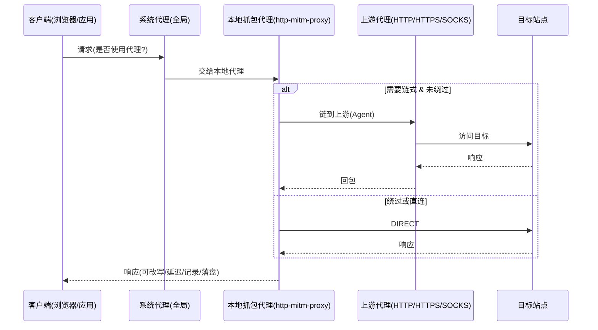

## 概览

本指南整合并取代《链式代理实现与性能总结》《抓包插件-架构与实现说明》。内容涵盖：系统架构、链式上游代理（HTTP/HTTPS/SOCKS）、全局代理接入方式、抓包与改写能力、数据存储、状态与守护、常见排障与实践建议。适配本仓主分支的最新实现（以 `src/core/captureProxy.js` 为准）。

## 目标与原则

- 目标：实现“注册-匹配-决策”架构下的系统级 HTTP/HTTPS 抓包，并支持把进入本代理的流量继续链式转发至上游代理（如 V2rayN）。
- 原则：一切皆插件；受限 API 通过 `window.MT.invoke('mt.secure-call', ...)` 访问；异步优先、可观测日志、沙箱与最小权限。
- 语言与安全：ES6+；错误 `try/catch`；页面/插件注意 XSS 转义；URL 只允许 http/https。

## 总体架构

- 主进程服务：`src/core/captureProxy.js`
  - 启动本地 MITM 代理（默认 `127.0.0.1:8888`，端口占用自动递增）。
  - 证书中心（CA）与每域证书签发；HTTPS 解密。
  - 代理层过滤：可按“目标域/通配/路径前缀”决定是否进入抓包记录链路（不命中时透传不入库）。
  - 记录链路：请求/响应头与正文（小体内联，大体落盘）；解压 gzip/deflate/br；JSON 自动美化。
  - 系统代理（Windows）开关：注册表写入 + PowerShell 兜底 + InternetSetOption 广播，采用全局代理模式。
  - 链式上游代理：在本地代理之后，继续转发到上游 HTTP/HTTPS/SOCKS 代理（如 V2rayN）。

- 渲染/插件：`plugins/http-sniffer`（UI 与交互）
  - 启停、本地/系统状态显示、列表与详情、cURL 复制、请求重放、HAR 导出。
  - 设置面板：上游开关/地址、目标域与路径前缀、改写/Mock 规则、落盘配额等。

## 核心数据流

要点：全局模式下所有HTTP(S)请求都进入本地代理；进入后是否走上游由本代理内部决定并强制执行（除本地/绕过域）。

## 链式上游代理

### 参数与来源

- `capture.start({ upstream })`
  - `'system'`：自动读取 Windows 系统代理（优先使用安装本工具前的备份 original.server），并据端口/显式协议判断 HTTP/HTTPS/SOCKS。
  - 显式对象：`{ http, https, bypass }` 或单一 URL，如 `socks5://127.0.0.1:10808`。

### 最新行为变更（重要）

- **移除自动熔断机制**：不再对上游代理进行自动熔断，由用户手动控制链式代理的开关状态。
- 使用 `'system'` 时"不再继承系统 ProxyOverride"，以避免在家庭网络环境（直连外网不可达）下被大范围绕过；本代理仅保留最小必要绕过（如 localhost）。
- CONNECT 阶段支持：为 HTTPS 建链在 `onConnect`/`onRequest` 均注入 Agent，保证 HTTPS 也能链式到上游。
- 自连保护：若上游地址等于本代理监听地址，自动忽略，防环路。
- **手动连通性测试**：提供上游代理连通性测试功能，支持用户选择不同测试端点（Google、百度等），手动验证代理可用性。

### 日志关键字

- `[CAPTURE][UPSTREAM] http=... https=... bypass=...`
- `[CAPTURE][UPSTREAM][test] ...`（手动连通性测试相关日志）
- `[CAPTURE][UPSTREAM][error] host=... error=...`（上游代理错误，仅记录不熔断）

## 全局代理模式

- **全局模式**：系统所有 HTTP(S) 请求都进入本地代理，这是唯一支持的系统接入方式。
- **实现方式**：通过修改 Windows 注册表设置全局代理，指向本地 MITM 代理（如 `127.0.0.1:8888`）。
- **代理层过滤**：虽然所有请求都会进入本地代理，但可通过"目标域"和"路径前缀"设置决定哪些请求需要记录到抓包列表中。
- **绕过机制**：内置绕过本地地址（localhost、127.*、内网IP段）以避免循环，其他绕过规则由链式代理的 bypass 配置控制。

**优势**：简单稳定，确保所有网络请求都能被处理和转发到上游代理（如果配置了链式代理）。

## 抓包过滤与规则

- 代理层过滤：
  - 目标域（集合或 `*.domain` 通配）与路径前缀（数组/逗号分隔），决定是否进入记录链路。
  - 未命中时仍可透传访问，但不会记录/落盘。

- 改写/断点：
  - `block`：阻断并返回自定义状态/头/体。
  - `mock`：直接返回 Mock 响应。
  - `setheaders`：改写请求/响应头。
  - 匹配条件：`method`、`hostIncludes`、`pathPrefix`、`headerEquals`。

- 延迟：
  - 规则格式字符串或数组；支持按 `method:pathPrefix=delayMs` 设置；命中则在 onResponse 前延迟。

## 数据与存储

- 内存环形缓冲：默认最大 2000 条（可配置）。
- 正文内联阈值：256KB，超出落盘至 `userData/data/capture/bodies/`。
- 自动解压：根据 `Content-Encoding` 识别 gzip/deflate/br。
- 目录配额：默认 512MB，超限按 mtime 从旧到新清理至 90%。
- HAR 导出：按当前内存记录生成最小可用 HAR。

## 系统代理与守护（Windows）

- **启用全局代理**：写入 `HKCU` 注册表的 `ProxyEnable/ProxyServer/ProxyOverride`，设置系统全局HTTP代理。
- **广播通知**：尝试 `InternetSetOption` 通知系统代理变更；个别环境可能失败，但注册表已生效。必要时手动切换系统代理开关或重启浏览器。
- **备份与恢复**：
  - 保存"启用前"的系统代理配置到 `capture/proxy-backup.json`。
  - 关闭/退出时优先恢复原系统代理设置；若发现系统仍指向本代理且服务未运行，启动时会自动修复。
- **多重兜底**：注册表失败时使用 PowerShell 命令兜底；应用/插件退出时通过多种事件监听确保系统代理恢复。

## UI 与操作要点（http-sniffer）

- **启动流程**：打开插件 → 启动本地代理 → 启用全局系统代理 → 开始抓包。
- **设置面板**：
  - **链式代理**：可选开关，支持 `system`（系统代理） 或显式地址如 `socks5://127.0.0.1:10808`、`http://127.0.0.1:10809`。
  - **连通性测试**：提供测试按钮和端点选择（Google国际、Google备用、Google APIs、百度国内），手动验证上游代理可用性。
  - **目标域与路径前缀**：决定哪些请求会被记录到抓包列表（不影响代理转发，只影响记录范围）。
  - **改写/Mock规则**：JSON数组格式；语法错误会被忽略。
  - **cURL/重放**：快速复制并复现请求（PS版本对Windows更友好）。

## 排障指南

1) **socket hang up 错误频繁出现**：
   - 通常是上游代理连接问题；检查链式代理是否正确配置且上游服务正常运行。
   - 如未使用链式代理，请确认链式代理开关已关闭。

2) **日志出现 `upstream=DIRECT`**：
   - 说明该请求被判定绕过了上游（例如 localhost 或显式绕过）；若不期望绕过，请检查 `bypass` 配置。

3) **`InternetSetOption broadcast => FAIL`**：
   - 注册表实际已写入，浏览器可能未立即刷新。手动切换系统代理开关或重启浏览器。

4) **HTTPS 报错**：
   - 确认"证书已安装"（用户根存储）；或尝试重新安装证书。

5) **上游连通性测试失败**：
   - 使用连通性测试功能验证上游代理；确认 V2rayN 等工具的端口（如 SOCKS 10808、HTTP 10809）与协议配置正确。
   - 尝试不同测试端点（Google国际、百度国内）来排查网络可达性问题。

6) **系统代理无法恢复**：
   - 应用/插件正常退出会自动恢复系统代理；异常退出可重启应用触发自动修复。
   - 手动修复：Windows设置 → 网络和Internet → 代理 → 关闭"使用代理服务器"。

## 关键接口与文件

- 主进程：`src/core/captureProxy.js`
- 插件：`plugins/http-sniffer/`
- 统一调用：`window.MT.invoke('capture.*')`
- 主要接口：
  - `capture.start/stop/status/list/detail/clear/exportHar`
  - `capture.installCert/uninstallCert/enableSystemProxy/disableSystemProxy`
  - `capture.testUpstream`（上游连通性测试）
  - `capture.toCurl/toCurlPS/replay`

## 性能与边界

- 链式会多一跳，上游质量决定整体 RTT/带宽；本地上游（如 V2rayN）性能影响通常较小。
- 部分站点 HSTS/Pinning 可能限制 MITM。
- Node 代理栈对 H2/H3 支持有限，必要时会降级到 HTTP/1.1。

## 实操建议

- **基础使用**：
  - 使用全局代理模式，简单稳定，所有HTTP(S)请求都会被处理。
  - 如需访问外网，配置链式代理指向本地代理工具（如V2rayN的SOCKS5端口）。

- **精准抓包**：
  - 通过"目标域"和"路径前缀"设置精确控制哪些请求会被记录，但不影响代理转发功能。
  - 所有请求都会经过本地代理，可以确保链式到上游代理的一致性。

- **连通性保障**：
  - 使用内置的连通性测试功能验证上游代理状态。
  - 不再有自动熔断，需要用户根据测试结果手动开关链式代理。

## 版本与变化记录（摘要）

- **v2024.09 重大变更**：
  - **移除PAC模式支持**：简化架构，统一使用全局代理模式，提升稳定性。
  - **移除自动熔断机制**：不再对上游代理进行自动熔断，交由用户手动控制。
  - **新增连通性测试**：提供手动上游代理测试功能，支持多种测试端点选择。
  - **增强系统代理恢复**：多重监听和兜底机制，确保应用退出时正确恢复系统代理。
  
- **保留功能**：
  - CONNECT 阶段链式支持；`system` 不继承 ProxyOverride；自连保护等核心功能。

