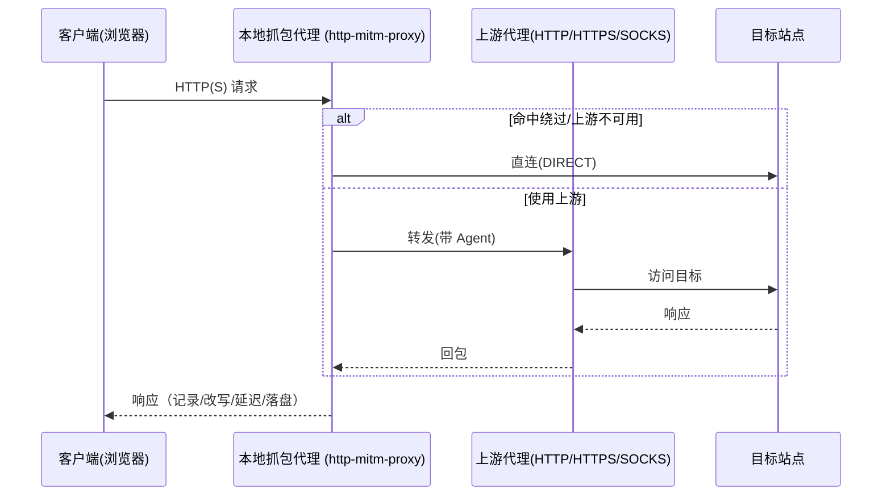

### 链式上游代理（Chained Upstream Proxy）实现与性能总结

本文件汇总本次在抓包代理中引入“链式上游代理”的设计、实现细节、日志与验证方法，以及性能影响与复杂度评估。适用于代码路径：
- 核心：`src/core/captureProxy.js`
- UI：`plugins/http-sniffer/index.html`、`plugins/http-sniffer/script.js`
- 主进程：`src/main.js`
- 依赖：`http-proxy-agent`、`https-proxy-agent`、`socks-proxy-agent`

---

#### 1) 能力概览
- 在 MITM 代理（本地抓包）之上，再串联一个“上游代理”（HTTP/HTTPS/SOCKS），形成链式转发：
  - client → 本地 MITM → 上游代理 → 目标站点
- UI 默认开启“链式代理”，并支持：
  - 自动侦测（`upstream: 'system'`）：从 Windows 注册表读取 ProxyServer/ProxyOverride，解析 `http=...;https=...;socks=...`，或按端口启发（1080/10808 等）自动判断 SOCKS5。
  - 手动指定：`http://host:port` / `https://host:port` / `socks5://host:port`。
- 兼容 PAC/全局两种启用方式，链式仅影响代理“出站”的一跳，抓包、改写、延迟、落盘逻辑不变。

---

#### 2) 参数与默认
- `capture.start(opts)` 新增：`opts.upstream`
  - `'system'`：自动侦测系统代理（优先解析 `socks=`，否则基于端口启发；继承 `ProxyOverride` 作为绕过名单）。
  - `{ http, https, bypass }`：显式指定上游与绕过；`http/https` 支持 `http://`、`https://`、`socks5://`（SOCKS 同时套在 http/https 出站）。
  - 关闭：UI 关闭“链式代理”开关，不传 `upstream`，与旧逻辑一致。

---

#### 3) 自动侦测与协议判定
- 来源：`querySystemProxy()` 读取注册表 `ProxyServer/ProxyOverride`；同时读取本工具备份的 `original` 条目，复原为“启用前的上游”。
- 解析：`_parseWinProxyServer()` 支持 `http=...;https=...;socks=...`；如仅有 `host:port` 则：
  - 端口 1080/10808/1086 → 视为 SOCKS5（`socks5://host:port`）
  - 其他端口 → 视为 HTTP（`http://host:port`）

---

#### 4) 运行时行为与日志
- 关键日志（便于确认链路）：
  - 启动：`[CAPTURE][UPSTREAM] http=%s https=%s bypass=%j`
  - 使用上游：`[CAPTURE][CHAIN][use] client->MITM->UPSTREAM(%s)->TARGET host=%s path=%s id=%s`
  - 绕过直连：`[CAPTURE][CHAIN][bypass] client->MITM->DIRECT host=%s path=%s id=%s`
  - 完成一条：`[CAPTURE][CHAIN][done] id=%s status=%s upstream=%s host=%s path=%s`
  - 上游不可达跳过：`[CAPTURE][UPSTREAM][skip] upstream not reachable, use DIRECT`
  - 上游熔断：`[CAPTURE][UPSTREAM][disabled] for 15s due to ...`

---

#### 5) 失败降级与恢复
- 可达性探测（启动时）：`_probeUpstreamReachable()` 对目标 `host:port` 进行 800ms TCP 探测，失败则不启用链式（DIRECT）。
- 熔断（运行时）：上游若触发 `ECONNREFUSED/ETIMEDOUT/ENETUNREACH/socket hang up` 等错误，进入 15s 熔断期，期间所有请求 DIRECT。
- 自连保护：若上游地址等于我们自己的监听地址（`host:port`），自动忽略，避免环路。
- 备份/还原：
  - 启用 PAC/全局前会将原系统代理配置写入 `proxy-backup.json`。
  - 关闭 PAC/全局或 `stop()` 时，若系统仍指向我们，则尝试 `_restoreProxyBackup()` 并广播 `InternetSetOption`。
  - 应用退出（`before-quit`）按顺序执行 `disablePAC()` → `disableSystemProxy()` → `stop()`，尽量确保还原。

---

#### 6) 与 PAC / 系统代理 / 证书
- PAC 与全局代理负责“入流”（客户端如何进来）；链式上游负责“出流”（代理如何出去），两者互不冲突。
- 证书流程不变：`installCert()/isCertInstalled()`；仅用于 HTTPS 抓包（MITM）。

---

#### 7) 性能影响（定性评估）
- 路由跳数：相比 DIRECT，多一跳至上游代理，网络 RTT 与带宽受上游影响；在本地上游（如 v2rayN）通常影响较小（1–3ms 量级）。
- 连接与建链：
  - MITM 与上游各自维护连接；首次请求会有握手开销（HTTP CONNECT / TLS）。
  - 已实现上游不可达快速降级，避免长时间超时阻塞。
- CPU 与内存：
  - MITM 仍可能解压/格式化响应（`zlib` 等），与是否启用上游无关。
  - 请求/响应体抓取与落盘（内联阈值 256KB）不变；极大流量下仍建议用 `maxBodyDirMB` 控制落盘配额。
- 额外逻辑开销：
  - 每请求一次绕过判定（host 后缀匹配，O(n) n=绕过项）。
  - onRequest 注入 Agent 为常数级；熔断窗口检查为常数级。

总体结论：在“上游为本地代理”的常见场景下，性能损耗可接受；真正瓶颈更取决于上游质量与外网链路。

---

#### 8) 实现影响面与复杂度
- 核心（中）：
  - `src/core/captureProxy.js`
    - 新增字段：`_httpUpstreamAgent/_httpsUpstreamAgent/_upstreamBypass/_ourServer/_upstreamDisabledUntil` 等
    - 新增方法：`_prepareUpstream()`、`_parseWinProxyServer()`、`_parseBypassList()`、`_isBypassedHost()`、`_probeUpstreamReachable()`
    - 在 `onRequest` 注入 `ctx.proxyToServerRequestOptions.agent`
    - 在 `stop()`/退出流程中增加“系统代理还原”兜底
- UI（低）：
  - `plugins/http-sniffer/index.html` 添加“链式代理”开关与“上游地址”输入，默认开启，默认 `system`
  - `plugins/http-sniffer/script.js` 在 `start()` 按设置传入 `upstream`
- 主进程（低）：
  - `src/main.js` 的 `before-quit` 改为异步顺序关闭，保证还原
- 依赖（低）：
  - 新增 `http-proxy-agent`、`https-proxy-agent`、`socks-proxy-agent`，并加入打包白名单

复杂度评估：中等偏低（主要逻辑集中在 `captureProxy.js`），对原有抓包/改写/导出等流程无侵入；UI 改动小，IPC 接口保持兼容。

---

#### 9) 已知边界与建议
- 系统代理为单一 `host:port` 且端口非常见值时，自动协议判定可能不准确，建议在 UI 手动显式声明 `http://` 或 `socks5://`。
- 个别站点对 MITM 证书严格（HSTS/Pinning），会提示 TLS 错误；与是否链式无关。
- 需要长时间链路稳定可考虑：
  - 调整熔断时长/探测超时为配置项；
  - 增加“上游健康状态”在 UI 的提示。

---

#### 10) 验收清单（Checklist）
- [ ] 仅启用抓包（不设置上游），浏览器可通；日志 `DIRECT`
- [ ] 启用上游为 v2rayN HTTP 端口，浏览器可通；日志 `[CHAIN][use]` 且 `upstream=http://...`
- [ ] 启用上游为 v2rayN SOCKS5 端口，浏览器可通；日志 `[CHAIN][use]` 且 `upstream=socks5://...`
- [ ] 关闭上游（或拔掉 v2rayN），首次开启插件自动降级 `DIRECT`；日志 `[UPSTREAM][skip]`
- [ ] 插件关闭/应用退出后，系统代理恢复为启用前配置（或关闭）；重启系统/应用后也不会遗留指向本代理

